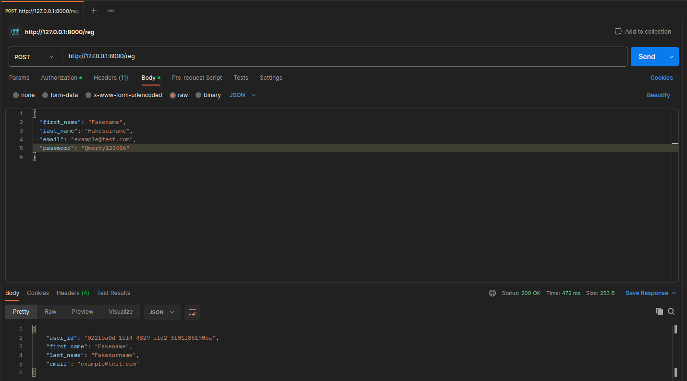
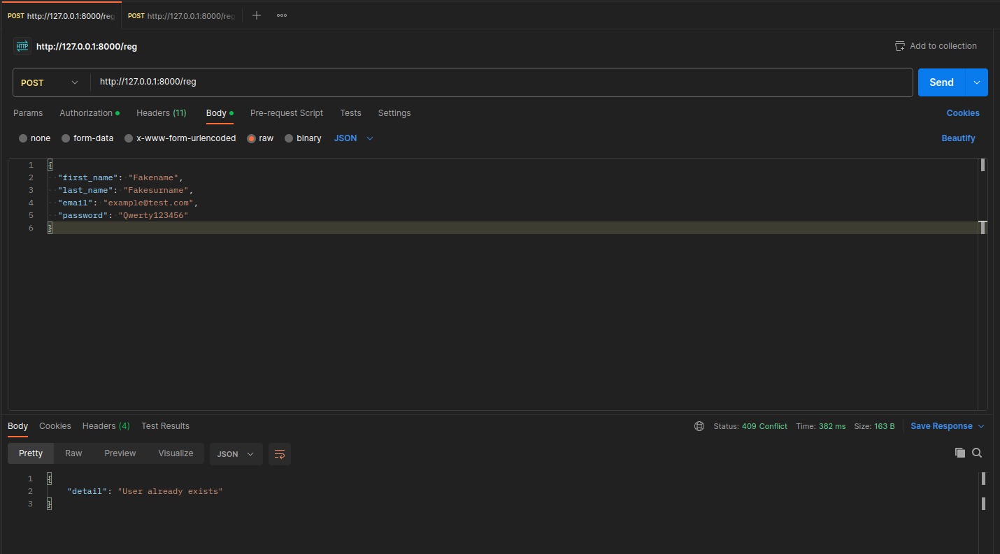
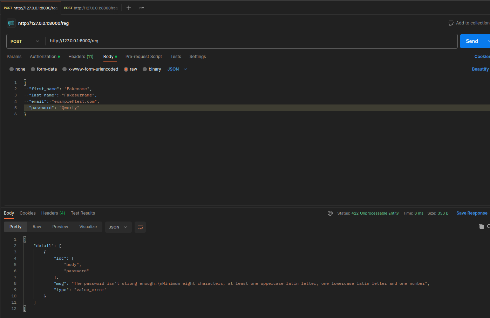

Here is the ways to run this app:

You could use the command in the Makefile by the order:
1) make run_app - run app
2) follow to http://0.0.0.0:8000/
3) you could find swagger docs at http://0.0.0.0:8000/docs/ 
4) make stop_app - delete container and all volumes

You could test it with pytest:
terminal$ pytest

Or you could test APIs by own hand.
The best way to test it with Postman.
Example with testing below:

JSON from example

{
  "first_name": "Fakename",
  "last_name": "Fakesurname",
  "email": "example@test.com",
  "password": "Qwerty123456"
}

Registration

Try to attempt to register with the same data
You will get the HTTP code 409 and detail "User already exists"

The similar result will occure if trying to send 'bad' data.
For example password should be 8 symbols at lest and consists with A-Z, a-z, 0-9 symbol

