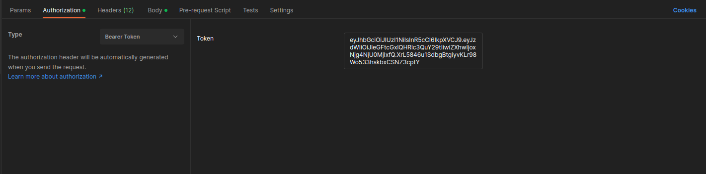

Here is the ways to run this app:


You could use the command in the Makefile by the order or use docker commands:

To run app:

    make run_app
or 

    docker compose up -d

Follow to http://0.0.0.0:8000/

You could find swagger docs at http://0.0.0.0:8000/docs/

To stop containers:
    
    make stop_app 
or 

    docker compose down -v


You could test it with pytest:

    make test 

or 

    pip install poetry && poetry install --no-interaction && poetry update && pytest -vv

The tests include unit and integrity tests. It uses PostgreSQL and Redis in containers, so Docker is a requirement.

Alternatively, you can test the APIs manually. 
The best way to do this is with Postman. 
Below is an example of how to test the APIs:

JSON from example

    {
      "first_name": "Fakename",
      "last_name": "Fakesurname",
      "email": "example@test.com",
      "password": "Qwerty123456"
    }

Registration sending post with credentials http://0.0.0.0:8000/reg


Authorization sending post with username and password http://0.0.0.0:8000/login/token
Username is an email of user.
In response you will get two tokens: 

Access token to get interact with other APIs


You shall send Access token in header.
You could add it in Authenticate header as example below


Refresh token to regenerate Access token if it is expires.
Refresh token will set in cookie


Post's doesn't exists yet.


Let's create it by API http://0.0.0.0:8000/post


    {
      "title": "Brand New Title",
      "content": "Amazing content"
    }


Let's try read the posts again


You could test another APIs in same way


About project tree
All alembic ini files:
```
.
├── alembic_dev.ini -------------------- development ini
├── alembic.ini ------------------------ ini to make migration in container 
├── alembic_test.ini ------------------- ini to make migration in tests 
├── auth_backend ----------------------- authorization backend 
│   ├── authenticate.py ---------- maintain and check of tokens and credentials  
│   ├── __init__.py
├── db
│   ├── db_config.py ------------- engine and sessions have created here
│   ├── db_schema.py ------------- db shema (db models)
│   ├── db_services.py ----------- CRUD services (DAL) 
│   ├── __init__.py
├── docker-compose_db.yml -------------- container with postgres to dev
├── docker-compose.yml  ---------------- containers with app, postgres, redis
├── Dockerfile  ------------------------ file for build images of app
├── img_dir_readme --------------------- dir with pic for README
├── main.py   -------------------------- APIs (entry point to run app manualy) 
├── Makefile  -------------------------- makefile to run some command
├── migration  ------------------------- standart alembic migrations
│   ├── env.py
│   ├── README
│   ├── script.py.mako
│   └── versions
│       ├── 45b499a98912_init.py
├── models.py ------------------------- data models by Pydantic to validate and serialize data
├── poetry.lock  
├── pyproject.toml 
├── README.MD
├── settings.py
├── tests   -------------------------- all tests here
│   ├── conftest.py
│   ├── docker-compose_test_cache.yml
│   ├── docker-compose_test.yml
│   ├── __init__.py
│   ├── test_authenticate.py
│   ├── test_cache.py
│   ├── test_db_services.py
│   ├── test_hasher.py
│   ├── test_main.py  --------- integrity tests
│   └── test_models.py
└── utils --------------------------- some useful utils
    ├── dependencies.py  ------------ different helper functions  
    ├── hasher.py  ------------------ passwords are hashing here
    ├── __init__.py
    ├── paginations.py   ------------ util for pagination 
```


